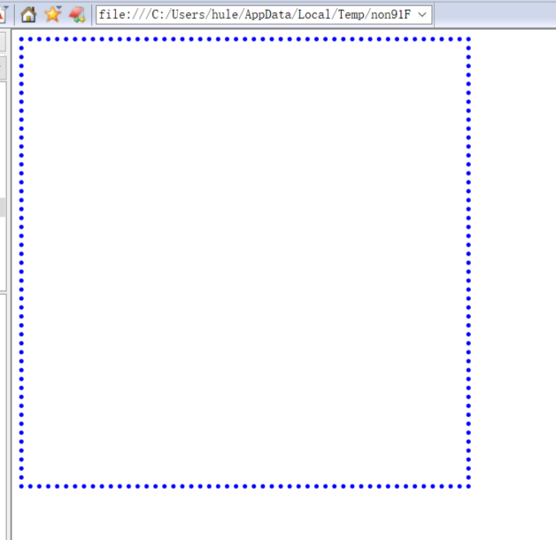
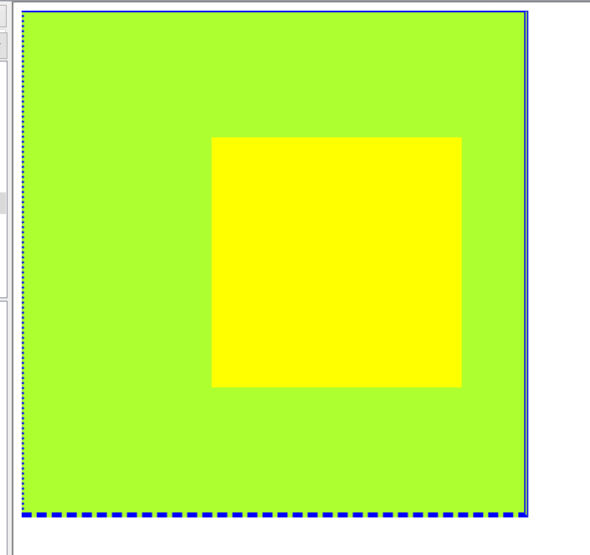

# css语法
html决定页面上战士什么内容，css决定页面美观成都，js修饰页面特效

css:层叠式样式表


## 外部样式表


为什么要用标签样式？每个标签都写样式太多了。

有了标签样式，为什么还有有类样式？
同一个p标签，我想弄成多种样式，可以分成类。java中调用类方法之类的用.所以这里也是.

---
# CSS盒子模型
## 边框样式



这里颜色不显示是因为加了引号


上面的背景颜色不知道为什么不显示





# css布局


```html
<!DOCTYPE html>
<html lang="en">
 <head>
  <meta charset="UTF-8">
  <meta name="Generator" content="EditPlus®">
  <meta name="Author" content="">
  <meta name="Keywords" content="">
  <meta name="Description" content="">
  <title>Document</title>
  <style>
	body{
		margin:0px;
		padding:0px;
		
	}
	#div1{
		height:20%;
		background-color:#abc;
	}
	#div2{
		height:80%;
		width:15%;
		background-color:pink;
		float:left;
		
	}
	#div3{
		
		height:70%;
		width:85%;
		background-color:whitesmoke;
		float:left;
	}
	#div4{
		height:10%;
		width:85%;
		background-color:#bca;
		float:left;
	}
  
  </style>
 </head>
 <body>
	<div id = "div1">div1<br/></div>
	<div id = "div2">
	div2<br/>div2<br/>div2<br/>div2<br/>div2<br/>div2<br/>
	</div>
	<div id = "div3">
	div3<br/>
	</div>
	<div id = "div4">
	div4<br/>
	</div>

 </body>
</html>

```


就算div设置了width，也是独占一行，右边不能放东西。只有设置了float才不是独占一行。
没有float的时候，是独占一行，所以width指的是剩余空间的百分比。
有float的时候，不是独占一行，width指的是父容器的百分比。

---
# css
```html
<!-- <!doctype html> -->
<html lang="en">
 <head>
  <meta charset="UTF-8">
  <title>Document</title>
  <link rel="stylesheet" href="05.css">
 </head>
 <body>
	<div id = "container">
		<div id ="fruit_list">
			<table id = "tbl_fruit">
				<tr>
					<th>名称</th>
					<th>单价</th>
					<th>数量</th>
					<th>小计</th>
					<th>操作</th>
				</tr>
				<tr>
					<td>苹果</td>
					<td>5</td>
					<td>20</td>
					<td>100</td>
					<td></td>
				</tr>
				<tr>
					<td>西瓜</td>
					<td>3</td>
					<td>20</td>
					<td>60</td>
					<td></td>
				</tr>
				<tr>
					<td>菠萝</td>
					<td>4</td>
					<td>25</td>
					<td>100</td>
					<td></td>
				</tr>
				<tr>
					<td>榴莲</td>
					<td>3</td>
					<td>30</td>
					<td>90</td>
					<td></td>
				</tr>
				<tr>
					<td>总计</td>
					<td colspan="4" align ="center">999</td>
				</tr>
			</table>
		
		</div>
	</div>
 </body>
</html>

```

```css
body{
	margin:0px;
	padding:0px;
	background-color:gray;
}
div{
	position:relative;
	float:left;
}

#container{
	width:80%;
	height:100%;
	border: 1px solid blue;
	margin-left:10%;
	background-color:honeydew;
	border-radius:8px;
}
#fruit_list{
	width:100%;
}
#tbl_fruit{
	/* width:100%; */
	width:60%;
	line-height:28px;
	margin-top:120px;
	margin-left:20%;

}
#tbl_fruit, #tbl_fruit tr,#tbl_fruit td,#tbl_fruit th{
	border:1px gray solid;
	/* width:100%; */
	border-collapse:collapse;
	text-align:center;
	font-size:16px;
	font-family:"黑体";
	font-weight:bold;
	color: threeddarkshadow;
}
.delImg{
	width: 24px;
	height:24px;
}


```


