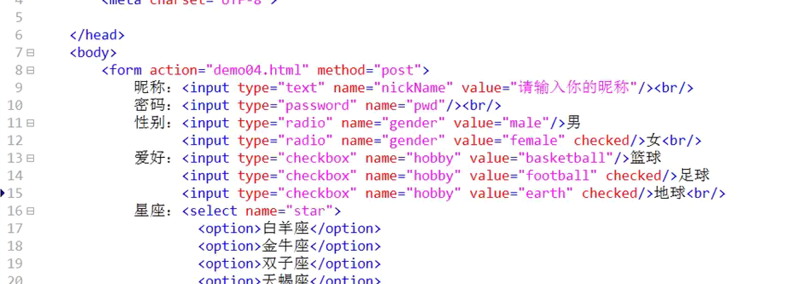
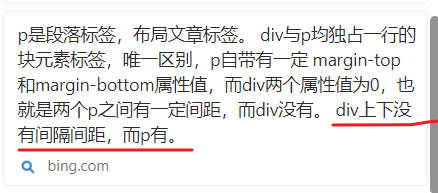

使用editplus预览html文件快捷键是ctrl+b
# 字符集


为什么会乱码？
因为文件编码是UTF-8
而浏览器显示的是GBK


这样就正常了

---
# Title


这里是设置抬头的地方
```html
<br/>
段落标签<p>
```
---

开始标签
结束标签

单标签
```html
 
 <br/>
	
```

---
# 图片

```html


```

这些是图片的属性

src属性表示：
width属性表示：
height属性表示：
alt属性表示：

如何提示图片：
如何设置宽度：
如何设置高度：
如何设定引用图片路径：

## 路径

相对路径是：
绝对路径是：

从硬盘根目录开始的文件路径是叫：
相对某个文件的文件路径是叫：

---
# 标题：
html里标题有几种大小？
从大到小分别是什么标签？


解释型语言
为什么在文本左右框上h7标签不会出错？


---
# 列表
```html

<ol type="A" start = 3>
	<li></li>
</ol>
```
## 有序列表

序号和开始位置


A a I i 1
英文 罗马数字 普通数字

## 无序列表


有三种样式：
disc square circle
# 加粗斜体下划线

不要这样


# 上下标


# 大于小于

# html实体字符

&nbsp; 是空格

# 块标签


# 超链接

target属性


# div层标签

div和p都是独占一行的块元素，p自带有一定 margin-top 和margin-bottom属性值，而div两个属性值为0，也就是两个p之间有一定间距，而div没有。 div上下没有间隔间距，而p有。


# 表格

### border


### width:


### cellspacing


### cellpadding:拍钉，挤压空间感


淘汰了：


border,width,cellspacing,cellpadding,align都淘汰了

## 水平线


## 行合并，列合并


---
# 表单


表单是有边框的


为什么上网时浏览器中能显示表单

向服务器请求访问的时候，返回了html文件，html文件中有form表单。
浏览器能打开html，打开了返回的html，就显示出来了表单。
我们填写表单，提交的时候不是所有的值都上传到服务器。有name属性才发送到服务器。


默认类型是


默认是get方式，会显示





---
# frameset与iframe
淘汰了


iframe


---
html是解释型语言，不区分大小写


html,head title meta body h1-h6 br ul ol li a img &npsb p div span




---
# 注释
```html

<!--这里是注释-->
```