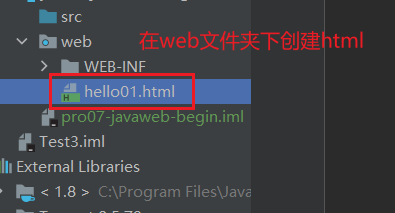
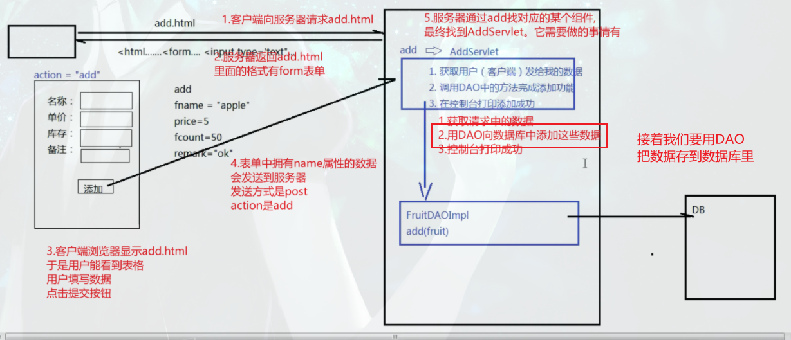

创建一个项目名字叫pro07-javaweb-begin
- 添加web
- 添加tomcat库、mysql和druid jar包。
- 更新artifact
- tomcat中选择新的artifact

 
 
  
  
  
  
  
  
  
  
  
  
  
  
  
  
  
  
  
  
  
  
  
  
  
  
  
  
  
  
  
  
  
  
  
  
  
  
  
  
  
  

  
  
  
  
  
  
  
