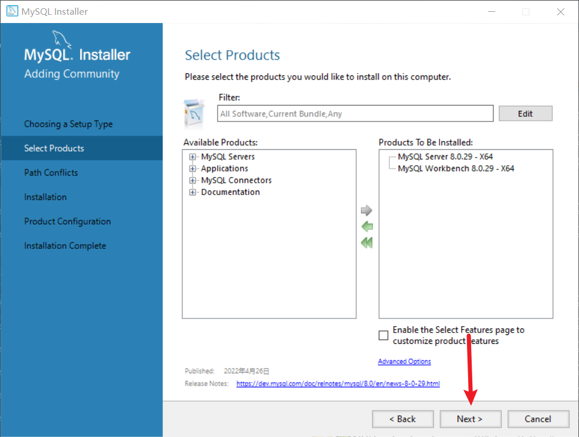
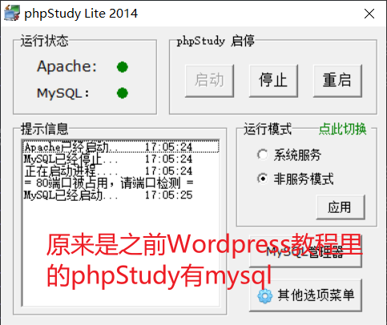
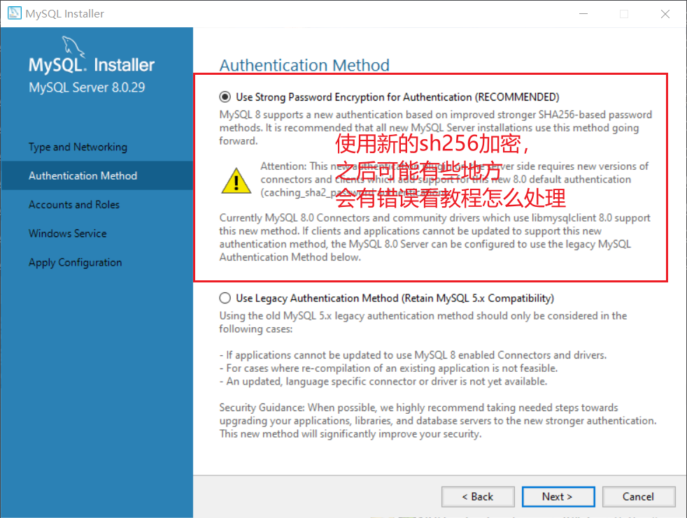

配置环境变量有什么用呢？
能在任意目录下，运行指令。

为什么mysql卸载后，数据库还在？
卸载Word以后，.doc文件也还在。卸载美颜app以后，照片还在。卸载mysql之后，数据当然还在。
数据在这c:/programData/MySQL/MySQL Server 8.0

卸载顺序：
1.停止mysql服务
2.控制面板卸载两个软件
3.删除环境变量
4.可选。
	mysql8.0卸载后注册表中内容自动没有。但是mysql5.7卸载后注册表还有残留，需要手动删除。
5.重启电脑

# 安装mysql
下载：

安装：
密码是abc123

登录方式

查看版本

mysql5.7插入中文失败

