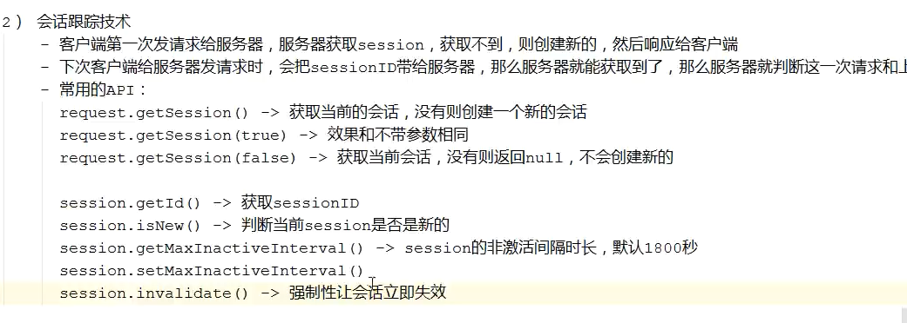
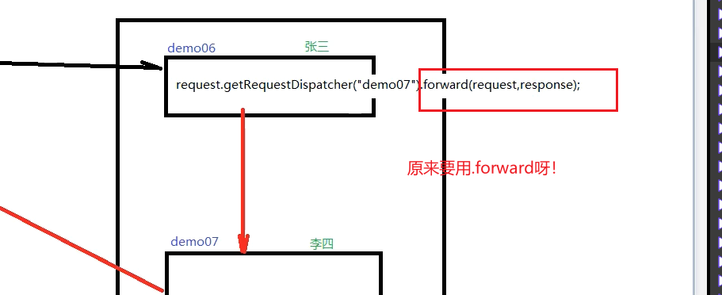
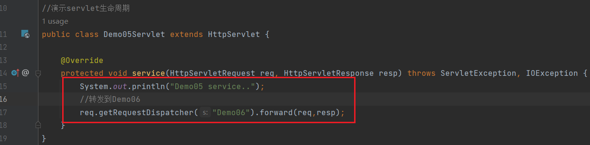
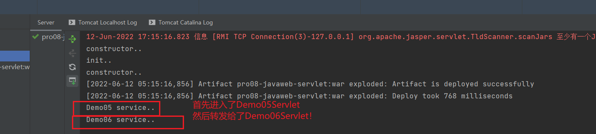
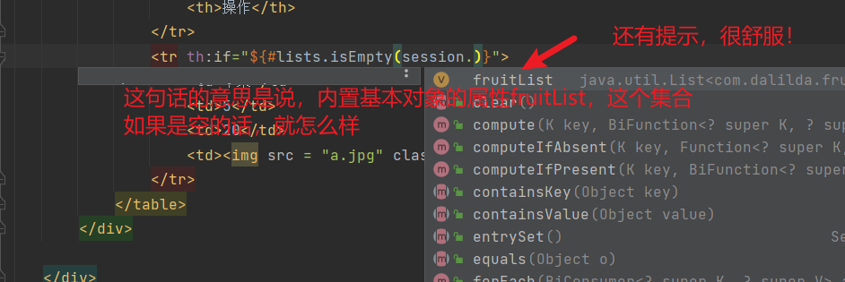
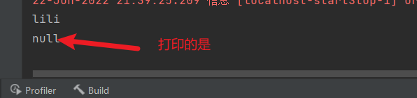

2022年6月9日

---
设置编码格式:
  
  
  
  
  
  
  

---
servlet继承关系
  
  
  
  
  
  
  
  
  
  
  
  
  
  
  
刚刚不知道为什么报错了,jdk源
  
  
继续演示:
  
  
  
  
  
  

---
servlet生命周期
  
  
  
  
  
  
  
  
  
  
  
  
  
  
  
  
  
  
  

load-on-startup  
  
  
  
  

单实例,多线程不安全
  
  
  
  

---
HTTP协议
  
  
请求

  
  
  
  
  
  
  
  
  
  
  
响应
  
  
  
  
  

---
会话
HTTP是无状态的。
  

实验一下：
  
  
  
  
  
  
  
  
  
  
  
  
  
  
  
  
  
  
  
  
  

Session保存作用域
  
实验一下：
  
  
  
  
  
  
  
  
  
  
 
 
服务器端转发与客户端重定向
  
  
  
服务器转发演示：
  
 
  

  
  
  
  
  
  
客户端重定向演示：
  
  
  
  
  
  
  
  

Thymeleaf-视图模板技术：
  
  
  
  
  
  
  
  
  
  
  
  
  
  
  
  
  
  
  
  
  
  
  
  
  
  
  

  
  

  
 
   
```java
public class ViewBaseServlet extends HttpServlet {

    private TemplateEngine templateEngine;

    @Override
    public void init() throws ServletException {

        // 1.获取ServletContext对象
        ServletContext servletContext = this.getServletContext();

        // 2.创建Thymeleaf解析器对象
        ServletContextTemplateResolver templateResolver = new ServletContextTemplateResolver(servletContext);

        // 3.给解析器对象设置参数
        // ①HTML是默认模式，明确设置是为了代码更容易理解
        templateResolver.setTemplateMode(TemplateMode.HTML);

        // ②设置前缀
        String viewPrefix = servletContext.getInitParameter("view-prefix");

        templateResolver.setPrefix(viewPrefix);

        // ③设置后缀
        String viewSuffix = servletContext.getInitParameter("view-suffix");

        templateResolver.setSuffix(viewSuffix);

        // ④设置缓存过期时间（毫秒）
        templateResolver.setCacheTTLMs(60000L);

        // ⑤设置是否缓存
        templateResolver.setCacheable(true);

        // ⑥设置服务器端编码方式
        templateResolver.setCharacterEncoding("utf-8");

        // 4.创建模板引擎对象
        templateEngine = new TemplateEngine();

        // 5.给模板引擎对象设置模板解析器
        templateEngine.setTemplateResolver(templateResolver);

    }

    protected void processTemplate(String templateName, HttpServletRequest req, HttpServletResponse resp) throws IOException {
        // 1.设置响应体内容类型和字符集
        resp.setContentType("text/html;charset=UTF-8");

        // 2.创建WebContext对象
        WebContext webContext = new WebContext(req, resp, getServletContext());

        // 3.处理模板数据
        templateEngine.process(templateName, webContext, resp.getWriter());
    }
}
```
  
  
  
  
现在我们能把请求转到index页面上。
接着我们要在index页面上，把数据动态整合进去。

需要使用thyemleaf：

  
  
  
  
  
  
  
  
  
  
  
  
  
  
  
  
  
http://c.biancheng.net/spring_boot/thymeleaf.html

  
  
  
  
  


---
保存作用域：
 
request保存作用域 
  
  
  
  
  
  
  
  
  
Dispatcher
  
  
  
senRedirect
  
  
  
  
  

session保存作用域
  
  
  
  
  
  
  
  
  
  
  
换成dispatcher结果一样
  
  

application保存作用域
  
  
  
  
  

  

---


