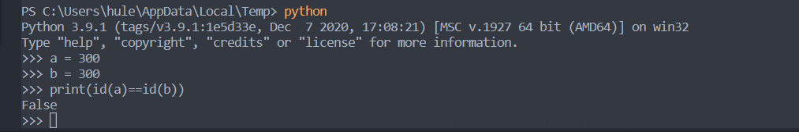

# 数组*n
```python
a = [1]
print(a*3)
print(a)
print(id(a))
print(id(a*3))
```

# 字符串*n
```python
b = "abc"
print(b*3)
print(b)
```

# 获取内存地址
```python
a = 3
b = 3
print(id(a))
print(id(b))

a = 300
b = 300
print(id(a)==id(b))
#这里是调用的.py脚本 后面定义变量的时候根据值相同，会把前面的拿来用
```

> 这里是python 原生解释器0-255以外的都是新的内存地址，id都不同

# 元组定义
```python
a = ()#tuple
b = (1)#int
c = (1,)#tuple
d = ("hule")#str
print(type(a),type(b),type(c),type(d))
```

# bool
```python
print(bool([]))
print(bool([1]))
print(bool(()))
print(bool((1)))
print(bool((1,)))
print(bool({}))
print(bool({1:2}))
print(bool(None))
print(bool(1))
print(bool(2))
print(bool(0.0))
print(bool(1.1))
print(bool(""))
print(bool("hule:"))
```
# 一行定义多个变量
```python
a,b,c= 1,2,3.3
print(a,b,c)
a=1
b=2
c=3
```

# 多行注释
```python

    """
    how are you?
    """
```

# 代码执行入口
```python
if __name__ =="__main__":
    print(123)
```

# 3.7以后字典有序
```python
d= {}
d["cat"]=1
d["apple"]=3
d["dog"]=2
print(d)
print(d)
#每次打印结果都一样
print(max(d))
print(min(d))
# max、min都是根据key来算的
```

# 字符串属于类
```python
a= "hule"
b='c'
print(type(a),type(b),type(1.1))
```

