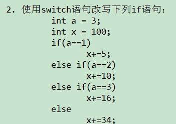
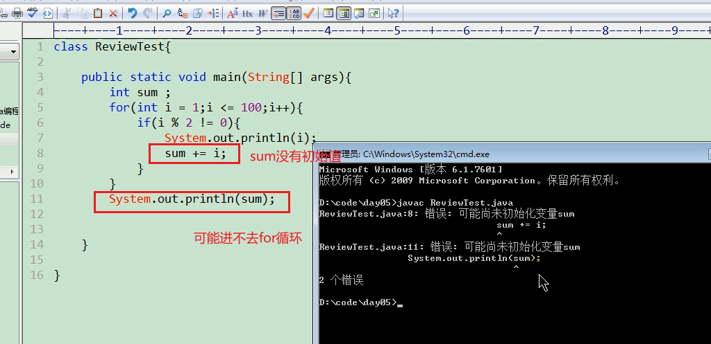
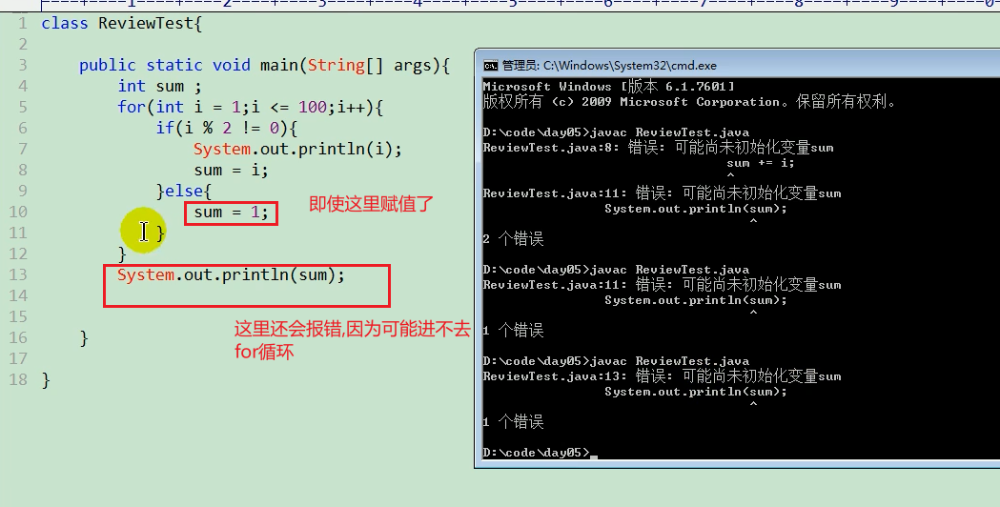
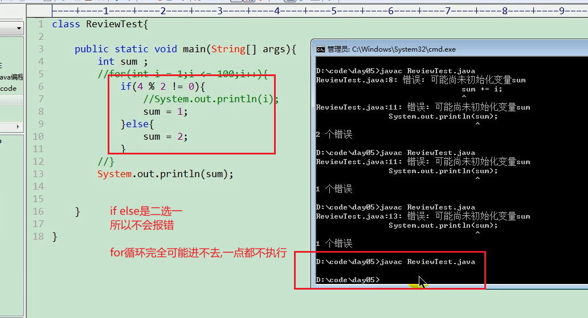

1. switch 后面使用的表达式可以是哪些数据类型的?
   byte short int char String 枚举类型
2.   
```java
    class Test{
        public static void main(String[] args){
            int a = 3;
            int x = 100;
            switch(a){
                case 1:
                    x += 5;
                    break;
                case 2:
                    x += 10;
                    break;
                case 3:
                    x += 15;
                    break;
                default:
                    x += 34;
                    break;
            }
        }
    }
```
3. 谈谈你对三元运算符,if-else,switch-case结构使用场景的理解
   优先使用三元,switch-case 
4. 如何从控制台获取String和int类型的变量,并输出?使用代码实现
   ```java
    import java.util.Scanner;
    class Test{
        public static void main(String[] args){
            Scanner sc = new Scanner(System.in);
            int id = sc.nextInt();
            String  = sc.next();
        }
    }
   ```
5. 使用for循环遍历100以内奇数,并计算所有的奇数的和并输出 
class Test{
    public static void main(String[] args){
        int sum = 0;
        for (int i = 0;i<100;i++){
            if(i%2 !=0 ){
                System.out.println(i);
                sum += i;
            }
        }
        System.out.println(sum);
           

        
    }
}
  
  
  


