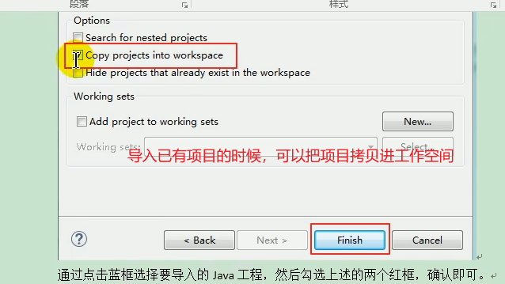

# eclipse设置
1. 选择工作空间的时候,不要勾选默认进入同一个工作空间
  
    

2. 
   调出console,package,navigate,outline等视图
     
   设置编码格式
     
   调整字体大小
     
   设置new的项目
     
   保存透视图
     
3. new 一个java项目
    
   运行项目 
     
4. 导入已有的项目
    
   可以选择把项目拷贝到工作空间 
     
5. 关闭项目
     
  
  
6. .metadata文件夹
     
7. 看源码
     
     
8. /**回车显示类的描述程序员信息,方法的描述
     
     
9. 常用快捷键
     

 

