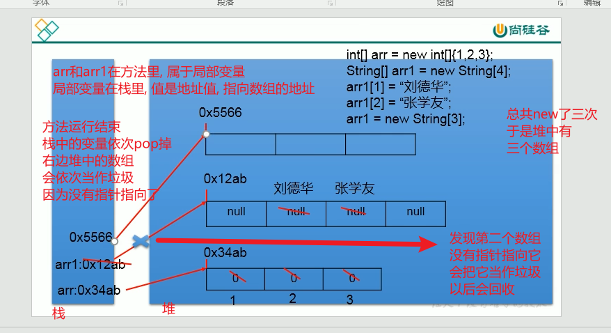
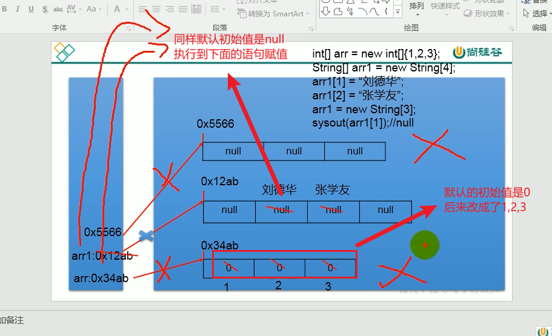

# 数组是多个相同类型数据按照一定顺序排列的集合,并使用一个名字命名,通过编号对数据进行管理.

# 常见概念:
1. 数组名
2. 下标
3. 元素
4. 数组长度

# 数组的特点:
1. 数组是有序的

2. 数组属于引用类型的变量
数组的元素可以是基本数据类型,也可以是引用数据类型

3. 创建数组对象,会在内存中开辟连续的一段空间

4. 数组的长度一旦确定就不能修改


# 数组的分类:
    1. 按照维度: 一维, 二维..
    2. 按照元素类型:基本数据类型元素数组, 引用数据类型元素数组

# 一维数组的使用:
    1. 一维数组的声明和初始化
    2. 如何调用数组的指定位置的元素
    3. 如何获取数组的长度
    4. 如何遍历数组
    5. 数组元素的默认初始值
    6. 数组的内存解析

```java

class Test{
    public static void main(String[] args){
        //1. 一维数组的声明和初始化
        //静态初始化
        int[] arr = new int[]{1,2,3};//长度根据后面算的
        //动态初始化
        int[] arr2 = new int[10];//长度就是这里的10 

        // int[] arr3 = new int[];//没写长度会报错
        //所以数组一旦初始化完成,长度就确定了

        int[] arrr2;//也可以先声明,后面再静态初始化或者动态初始化
        

        //2. 调用数组的指定位置的元素
        System.out.println(arr[0]);
        System.out.println(arr[1]);
        System.out.println(arr[2]);
        // System.out.println(arr[3]);//index out of bounds
        System.out.println(arr2[0]);

        //3.获取数组长度
        System.out.println(arr.length);
        System.out.println(arr2.length);


        System.out.println("____________");
        //4.遍历数组
        for(int i=0; i<arr.length;i++){
            System.out.println(arr[i]);
        }
        for(int i =0;i<arr2.length;i++){
            System.out.println(arr2[i]);
        }
        System.out.println("________");
        //5.数组默认初始值
        //需要动态初始化,我们才能打印默认初始值
        // 整型:0 
        // 浮点型:0.0 
        // char:'\0' or '\u0000' 
        // boolean:false 
        // 引用类型: null 注意不是"null"!!!
        
        String[] arr4 = new String[5];//null
        System.out.println(arr4[0]);
        
        System.out.println("_________");

        boolean[] arr5 = new boolean[5];//false
        char[] arr6 = new char[5];//空字符
        System.out.println(arr5[0]);
        System.out.println("|"+arr6[0]+"|");
        
        System.out.println("___________");

        float[] arr7 = new float[5];//0.0
        double[] arr8 = new double[5];//0.0
        System.out.println(arr7[0]);
        System.out.println(arr8[0]);
        
        System.out.println("___________");

        byte[] arr9 = new byte[5];//0
        short[] arr10 = new short[5];//0
        int[] arr11 = new int[5];//0
        long[] arr12 = new long[5];//0
        System.out.println(arr9[0]);
        System.out.println(arr10[0]);
        System.out.println(arr11[0]);
        System.out.println(arr12[0]);
// int[] arr = new int[]{1,2,3};
// String[] arr1 = new String[4];
// arr1[1] = "aaa";
// arr1[2] = "bbb";
// arr1 = new String[3];
// System.out.println(arr1[1]);
        

    }
}
```

内存解析:
  
  
