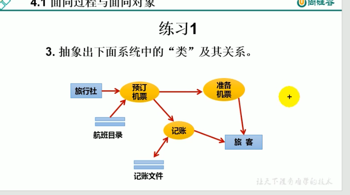

面向过程(POP) 面向对象(POP)
面向过程,强调的是功能行为,以函数为最小单位,考虑怎么做
面向对象,是将功能封装进对象,强调的是具备功能的对象,以类/对象为最小单位,考虑谁来做

人把大象塞进冰箱里:
面向过程:
1. 把冰箱门打开()
2. 把大象塞进冰箱里()
3. 把冰箱门关闭()

面向对象:
冰箱类{
    开开(){
        ...
    }
    关闭(){
        ...
    }
}

大象类{
    进入(冰箱){
        ...
    }
}

人类{
    打开(冰箱){
        冰箱.开开()
    }
    抬起(大象){
        大象.进入(冰箱)
    }
    关闭(冰箱){
        冰箱.关闭()
    }

}

面向过程就像企业刚开始的时候,可能就几个人,分工不明确,你不会我就来,主要是要解决问题
当企业变成500人以上了,就需要有各种部门,各个部门负责各自的工作,不然就很乱

POP:Procedure Oriented Programming
OOP:Object Oriented Programming

面向对象的思想概述
程序员,从面向过程的**执行者**转化成了面向对象的**指挥者**
面向对象分析方法分析问题的思路和步骤:
    1. 根据问题需要,选择问题所针对的**现实世界中的实体**
    2. 从实体中寻找解决问题相关的属性和功能,这些属性和功能就形成了**概念世界中的类**
    3. 把抽象的实体用计算机语言进行描述,**形成计算机世界中类的定义**.即借助某种程序
    语言,把类构造成计算机能够识别和处理的数据结构
    4. 将**类实例化成计算机世界中的对象**.对象是计算机世界中解决问题的最终工具

练习1
开车去丽江,类有什么?人、车、丽江(若丽江描述信息很丰富,也可以当成类,不然可以只当成字符串)

旅行社、航班目录、机票、记账文件、旅客
名词:类
动词:类具备的功能
