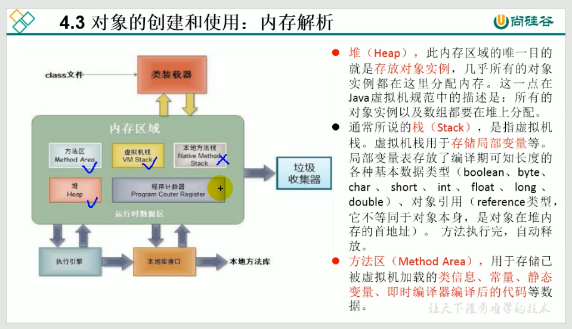
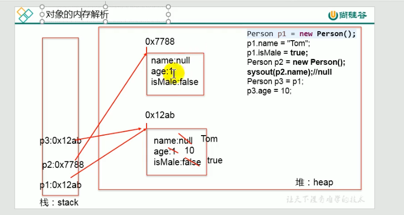

本地方法栈是调用c或c++的类库
---
我们需要关注堆、栈、方法区

1. 栈(Stack)
我们通常所说的栈, 是虚拟机栈
虚拟机栈用于**存放局部变量**等
局部变量表存放了编译期可知长度的各种基本数据类型、对象引用,方法执行完自动释放

2. 堆(Heap)
堆用来**存放对象实例**

3. 方法区(Method Area)
用于存放被虚拟机加载的**类信息**,**常量**,**静态变量**,**即时编译器编译后的代码**等数据

---
方法中的变量都是局部变量,都在栈中
对象的属性在堆中

---

