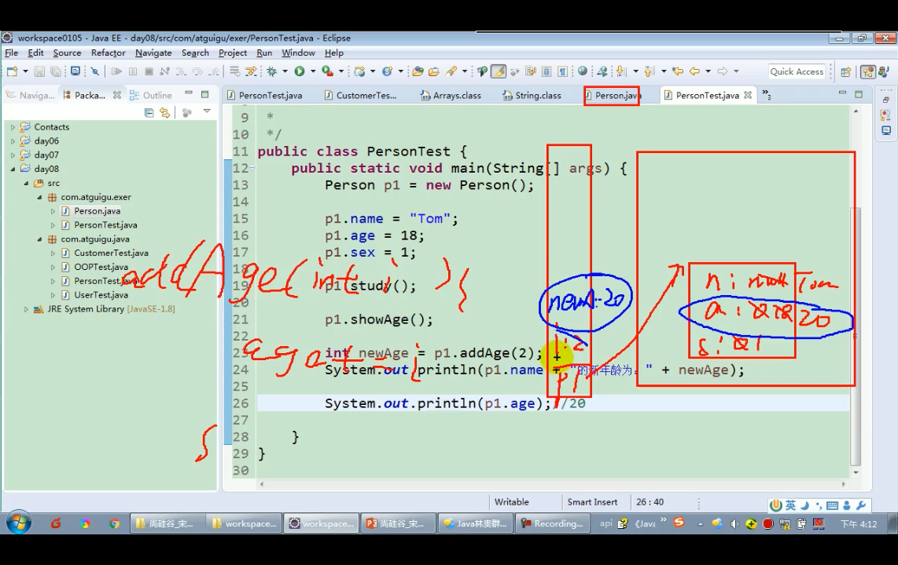
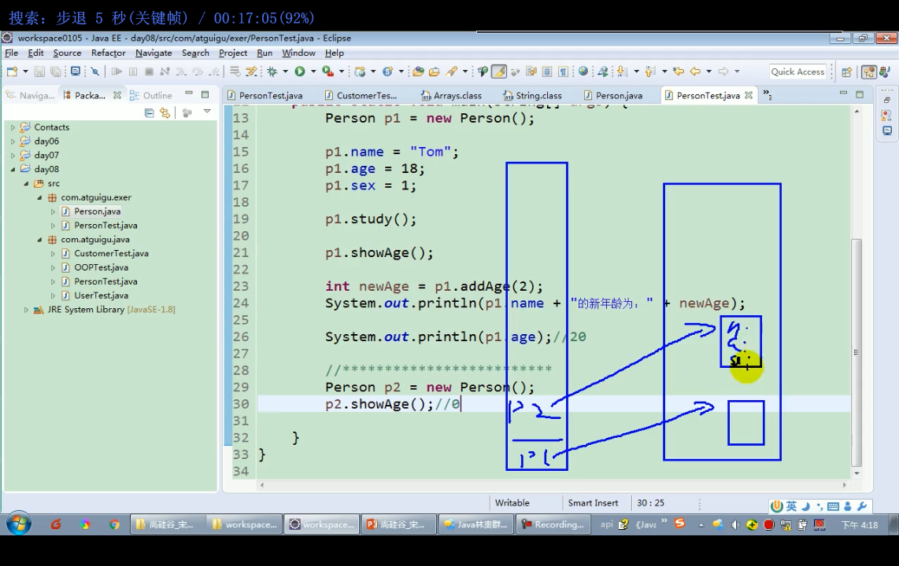

练习1:
```java
    class Student{
        String name;
        int age;
        String major;
        String interests;
        public void say(String sentence){
            System.out.println("name: " + name + " age: " + age + " interests: " + interests + " major: " + major);
        }
    }
    class Teacher{
        String name;
        int age;
        int teachAge;
        String course;
        public void say(){
            System.out.println("name: " + name + " age: " + age + " teachAge: "+ teachAge + " course: " + course);
        }
    }
    class Test{
        public static void main(String[] args) {
            Teacher a = new Teacher();
            a.say();
            Student s = new Student();
            s.say();
        }
    }
```
----------------------------------------------------------------
练习2:
```java
 class Person{
    String name;
    int age;
    int sex;
    public void study(){
        System.out.println("learning");
    }
    public void showAge(){
        System.out.println(age);
    }
    public int addAge(int i){
        age+=i;
        return age;
    }
    
}
class Test{
    public static void main(String[] args) {
        Person p = new Person();
        p.name = "John";
        p.age = 1;
        p.sex = 0;
        p.showAge();
        p.study();
        p.addAge(2);
        p.showAge();
    }
}
```
  
  


--------------------------------
自己研究1:
```java
class Test{
    public static void main(String[] args){
        
    }
    public void getChars(char[] arr6) {
        arr6 = {'a'};//赋值的时候不能赋数组常量, 只有静态初始化的时候能用数组常量
    }
}
```

------------------------------------------------
自己研究2:
```java
class Person{
    String name;
    int age;
    int sex;
    public void study(){

    }
    public void showAge(){
        System.out.println(age);
    }
    public int addAge(int age){
        System.out.println("_");//("_");
        age+=1;//实际上类的属性age没+1, 加的是形参
        if (age>=3){
            return age;
        }
        return addAge(age);//这里的age就不是类的属性了,而是方法的形参,每次调用在栈中都有一个形参变量
        //只是值赋过来了,就好想是同一个变量一样,实际上不是同一个变量
        //形参会随着方法结束而消亡

    }
}
class Test{
    public static void main(String[] args) {
        Person p1 = new Person();
        p1.name="p1";
        p1.age=20;
        p1.sex=1;
        p1.study();
        p1.showAge();
        p1.addAge(1);
        p1.showAge();
        System.out.println(p1.addAge(1));
        System.out.println(p1.addAge(10));
        Person p1 = new Person();
        p2.addAge(100);
        p2.showAge();
    }
}
```