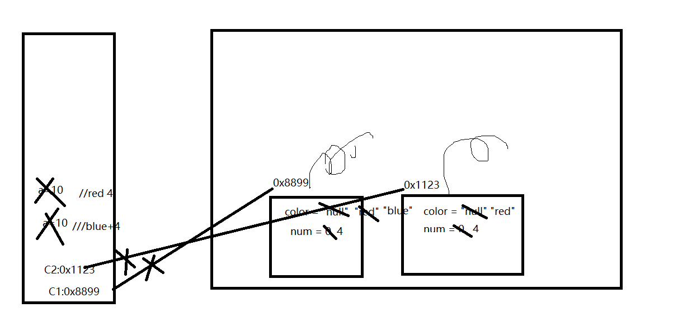

1. 面向对象思想编程内容有哪三大部分?
1. 类及类的成员:属性、方法、构造器、代码块、内部类
2. 面向对象三大特性:封装、继承、多态
3. 其他关键字:this,super,abstract,static,final,import,interface,package,

2. 类和对象的理解,关系
类是事物的抽象描述,对象是实实在在存在的个体
对象是类new出来的,派生出来的

3. 面向对象思想的体现一:类和对象的创建和执行操作有哪三步?
    1. 设计类及类的成员
    2. 类的实例化
    3. 调用对象的结构 对象.属性  对象的方法

4. 画出如下代码在执行时的内存分配情况
```java
    class Car{
        String color = "red";
        int num = 4;
        void show(){
            int a = 10;
            System.out.println("color="+color+",num="+num);
        }
    }
    class CarTest{
        public static void main(String[] args) {
            Car c1 = new Car();
            Car c2 = new Car();
            c1.color = "blue";
            c1.show();
            c2.sho2();
        }
    }
```
  

5. 类的方法内是否可以定义变量?是否可以调用属性?是否可以定义方法?是否可以调用方法?
   可以,可以,不可以,可以


