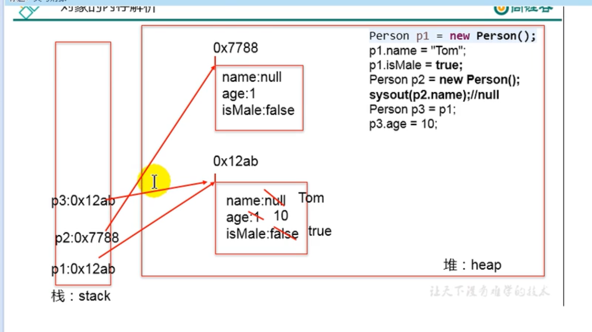

1. 面向对象学习的三条主线:
   1. 类及类的成员
   2. 面向对象三大特征
   3. 其他关键字
2. 面向对象和面向过程(理解)
   面向过程强调的是功能,最小的单位是函数,考虑怎么做
   面向对象强调的是具备功能的对象,最小单位是对象,考虑谁来做
   面向过程编程人员是执行者
   面向对象编程人员是指挥者
3. 完成一个项目的思路
   从现实中找实体
   把实体的属性和功能弄成类
   把类用计算机语言实现
   把类实例化

4. 面向对象中两个重要的概念
   类和对象
   类是事物的抽象描述, 对象是实实在在存在的个体
   对象是类new出来的
5. 面向对象思想落地实现的规则一
   1.创建类及类的成员
   2.创建类的对象
   3.调用对象的结构
补充:几个概念说明
    属性 = field = 成员变量= 域、字段
    方法 = 成员方法 = 函数 = method
    创建类的对象 = 类的实例化 = 实例化类

6. 对象的创建与对象的内存解析
   典型代码:
   Person p1 = new Person();
   Person p2 = new Person();
   p2 = p1
   p1.name  = "hule";
   System.out.println(p2.name);

   内存解析:
     
7. 匿名对象
   new Person().eat();
   assignwork(new Person());

8. 编译完源程序以后,生成一个或多个class文件,使用JVM中的类加载器和解释器对生成的class文件进行解释运行.
   意味着,需要将字节码文件对应的类加载到内存中,涉及到内存解析.
   堆:new出来的结构放到堆空间中(数组、对象). 补充:对象的属性(非static)加载在堆中
   虚拟机栈:局部变量
   方法区:类的加载信息、常量池、静态域

9. 属性与方法
    属性vs局部变量
        1. 相同点:都是变量,需要遵循变量的基本规则:定义格式、先声明后使用、作用域
        2. 不同点:
           1. 声明位置不同
           2. 权限修饰符不同
           3. 默认初始化值不同
           4. 在内存中的加载位置
变量分类:
   1. 根据类型分
      1. 基本数据类型
         1. 数值型
         2. 浮点型
         3. 布尔型
      2. 引用数据类型
         1. 类
         2. 接口
         3. 数组
   2. 根据声明位置分
      1. 成员变量
         1. 实例变量(不以static修饰)
         2. 类变量(以static修饰)
      2. 局部变量
         1. 形参
         2. 方法局部变量
         3. 代码块局部变量

方法:
    描述类应该具有的功能
方法的声明:
   权限修饰符 返回值类型 方法名(形参列表){
      方法体
   }
说明:
   1. 4种权限修饰符 public private protected 缺省
   2. 返回值类型 vs 无返回值类型
      有返回值,return 返回值;结束方法  方法声明时要声明返回值类型
      无返回值,可以用return;结束方法  方法声明时要声明void
   3. 方法名:属于标识符,小驼峰,字母数字下划线`$`符号组成
   4. 形参列表
      形参可以有0个,1个,多个
   5. 方法体
      方法功能的体现

方法的使用中,可以调用当前类的属性或方法
   特殊的:方法A中有调用了方法A:递归方法
方法中不可以定义方法