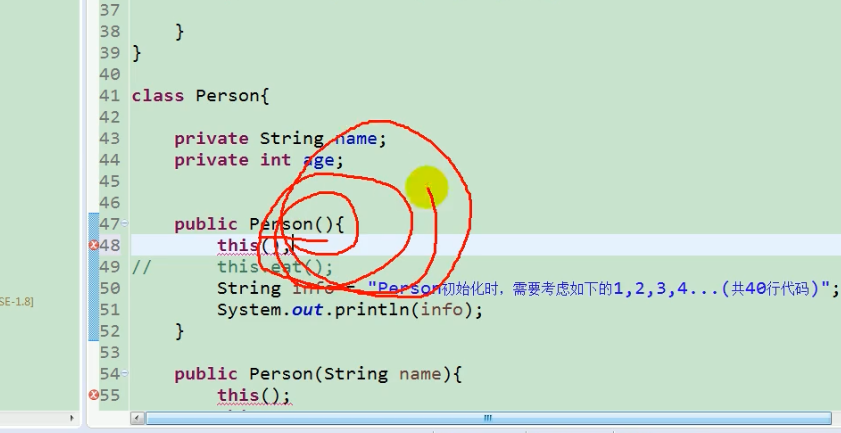
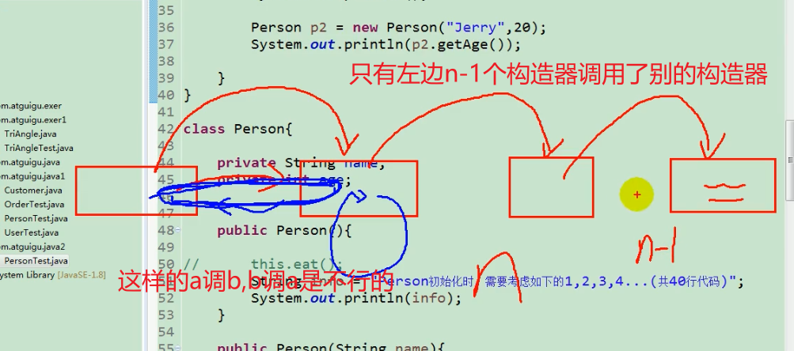
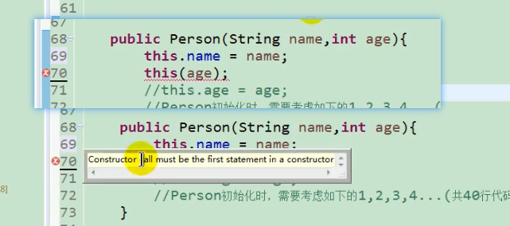
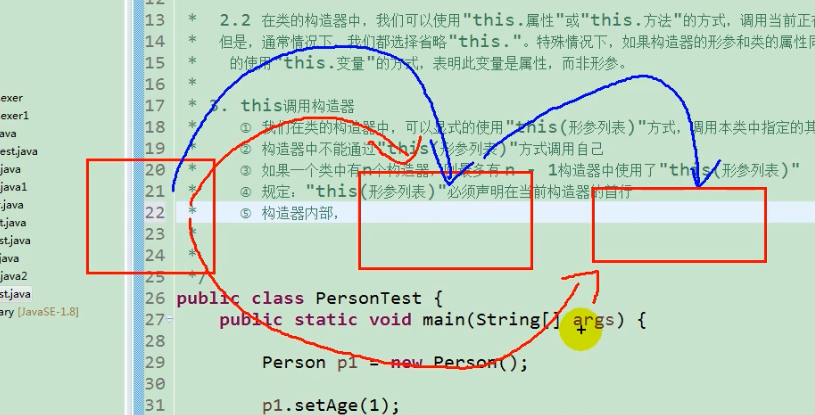

this关键字的使用
1. this可以用来修饰、调用: 属性、方法、构造器
2. this修饰属性和方法:
    this理解为当前对象 或 当前正在创建的对象

    2.1 在类的方法中,我们可以使用"this.属性"或"this.方法"来调用当前对象的属性和方法
    通常情况下this可以省略
    特殊情况下,如果方法的形参和属性名相同时,我们必须显式地使用"this.变量"来表明用的是属性而不是形参

    2.2 在类的构造器中,我们可以使用"this.属性"或"this.方法"调用当前正在创建的对象的属性和方法
    通常情况下this可以省略
    特殊情况下,如果构造器的形参和属性名相同时,我们必须显式地使用"this.变量"来表明用此变量是属性而不是形参
3. this调用构造器
    1. 类的构造器中, 可以显式地使用"this(形参)"的方式, 调用本类中指定的**其他**构造器
    2. 构造器中不同通过"this(形参)"方式调用自己
          

    3. 如果一个类中有n个构造器, 最多只有n-1个构造器中使用"this(形参)"
          

    4. 规定:"this(形参)"必须放在当前构造器中的首行
          

    5. 构造器内部, 最多只能声明一个"this(形参)", 用来调用其他构造器
          


```java
    class Person{
        private String name;
        private int age;
        public Person(){
            this.eat();
            //Person初始化时要考虑如下1,2,3,4...(40行代码)
        }
        public Person(String name){
            this.name = name;
             //Person初始化时要考虑如下1,2,3,4...(40行代码)
        }
        public Person(int age){
            this.age = age;
             //Person初始化时要考虑如下1,2,3,4...(40行代码)
        }
        public Person(String name , int age){
            this.name = name;
            this.age = age;
             //Person初始化时要考虑如下1,2,3,4...(40行代码)
        }
        public void setName(String name) {
            this.name = name;
        }
        public String getName(){
            return this.name;
        }
        public void setAge(int age) {
            this.age = age;
        }
        public int getAge(){
            return this.age;
        }
    }
    class Test{
        public static void main(String[] args){
            Person p1 = new Person();
            p1.setAge(1);
            System.out.println(p1.getAge());
        }
    }
```

上面的代码冗余了, 除了把相同的代码弄成方法外
还可以构造器中调用别的构造器
```java
class Person{
    private String name;
    private int age;
    public Person(){
        // this.eat();
        System.out.println("开始前需要做1,2,3,4...件事, 共40行代码");
    }
    public Person(String name){
        this();
        this.name = name;
    }
    public Person(int age){
        this();
        this.age = age;
    }
    public Person(String name , int age){
        this(age);
        this.name = name;
        // this.age = age;
    }
    public void setName(String name) {
        this.name = name;
    }
    public String getName(){
        return this.name;
    }
    public void setAge(int age) {
        this.age = age;
    }
    public int getAge(){
        return this.age;
    }
}
class Test{
    public static void main(String[] args){
        Person p1 = new Person("hule",20);
        // p1.setAge(1);
        System.out.println(p1.getAge());
        System.out.println(p1.getName());
    }
}
```