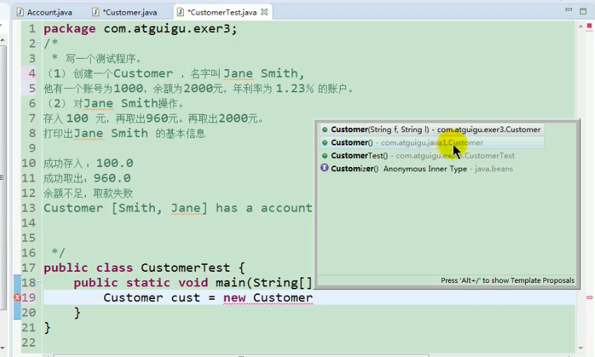

```java
class Account{
    private int id;
    private double balance;
    private double annualInterestRate;
    public Account(){

    }
    public Account(int id, double balance, double annualInterestRate){
        this.id  = id;
        this.annualInterestRate = annualInterestRate;
        this.balance = balance;
    }
    public double getBalance(){
        return this.balance;
    }
    public int getId(){
        return this.id;
    }
    public double getAnnualInterestRate(){
        return this.annualInterestRate;
    }
    public void setId(int id) {
        this.id = id;
    }
    public void setBalance(double balance) {
        this.balance = balance;
    }
    public void setAnnualInterestRate(double annualInterestRate) {
        this.annualInterestRate = annualInterestRate;
    }
    public void withdraw(double amount){
        if(amount < this.balance){
            this.balance = this.balance-amount;
            System.out.println("withdraw money:"+amount);
            // System.out.println("balance:"+this.balance);
        }else{
            System.out.println("balance is not enough");
        }
    }
    public void deposit(double amount){

        // System.out.println("original balance:"+this.balance);
        this.balance +=amount;
        System.out.println("deposit:"+amount);
        // System.out.println("after deposit balance:"+this.balance);
    }
}
class Customer{
    private String firstName;
    private String lastName;
    private Account account;
    public Customer(){

    }
    public Customer(String firstName, String lastName){
        this.firstName = firstName;
        this.lastName = lastName;
    }
    public String getFirstName(){
        return this.firstName;
    }
    public String getLastName(){
        return this.lastName;
    }
    public void setAccount(Account account) {
        this.account = account;
    }
    public Account getAccount(){
        return this.account;
    }
}

class Test{
    public static void main(String[] args) {
        Customer c = new Customer("Jane","Smith");
        Account a = new Account(1000,2000,0.0123);
        c.setAccount(a);
        c.getAccount().deposit(100);
        c.getAccount().withdraw(960);
        c.getAccount().withdraw(2000);
        System.out.println(c.getAccount().getBalance());
        System.out.println("Customer: " +"[" + c.getFirstName()+" "+c.getLastName() +"]" +" has an account: id is " +c.getAccount().getId() + ", annualInterestRate is " +c.getAccount().getAnnualInterestRate()*100+"%"+", balance is " +c.getAccount().getBalance());
    }
}
```

  alt+/提示

