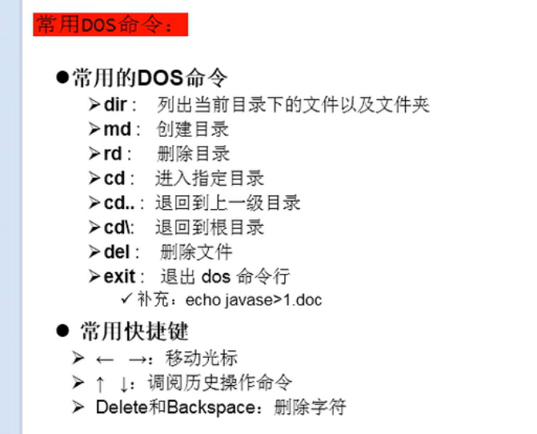

# 基础程序设计
关键字
输出类型
运算符
流程控制
数组
# 面向对象编程
类/对象
类的结构
三大特性
接口
设计模式
# 应用程序开发
JDBC->ORacle/MySQL
集合
IO/NIO
类库
多线程
异常处理
反射
网络
# Java新特性
泛型
元注解
装箱/拆箱
枚举
可变参数
Lambda参数
Stream API
Date/Time API

1.基础知识
程序 = 算法+数据结构

常用DOS命令
  
