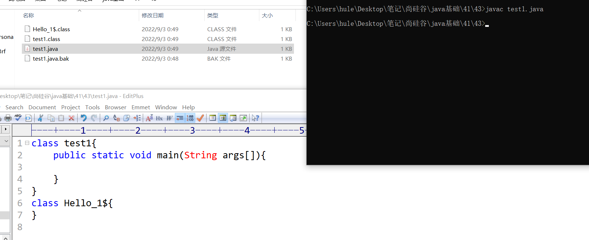
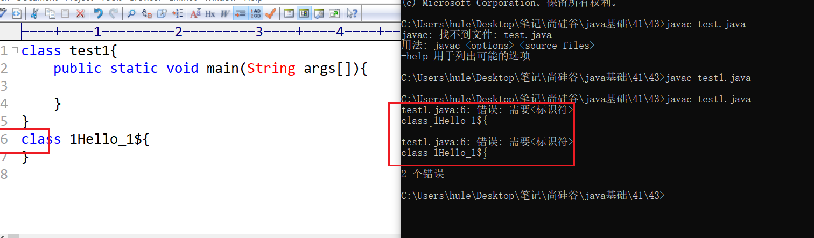
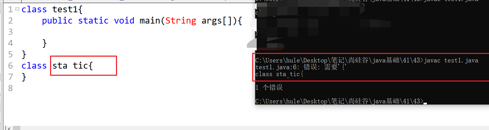
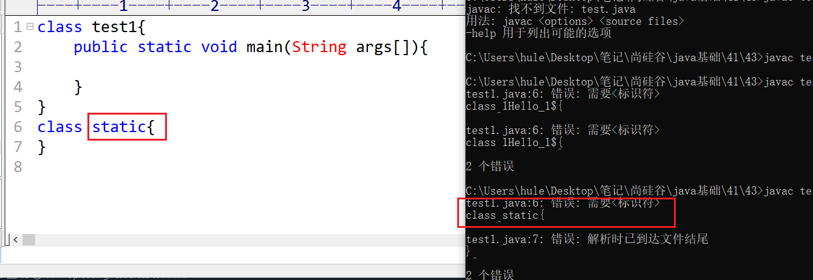
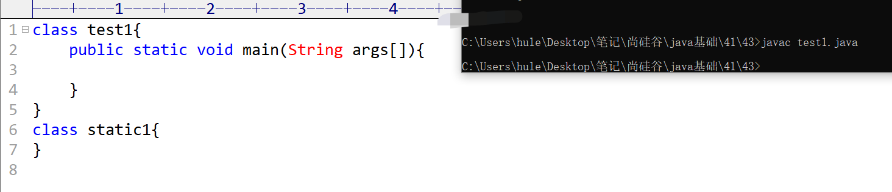
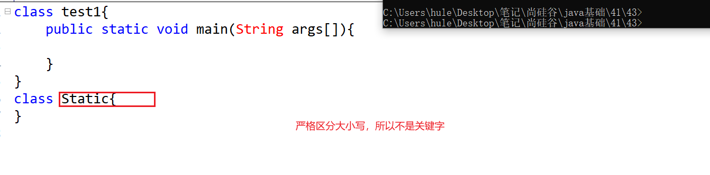

# 标识符
对**类**、 **变量**、**方法**、**接口**、**包**等命名时使用的**字符串序列**称为**标识符**
技巧：一切需要我们自己起名字的地方都叫标识符。

标识符规则：
由**字母** **数字** **_** **$** 组成
  
数字不能开头
  
不能有空格
  
不能是关键字和保留字，但是可以包含关键字和保留字
  
  

区分大小写，长度无限制。
  

如果不遵守命名规则。编译会不通过，会报错。

