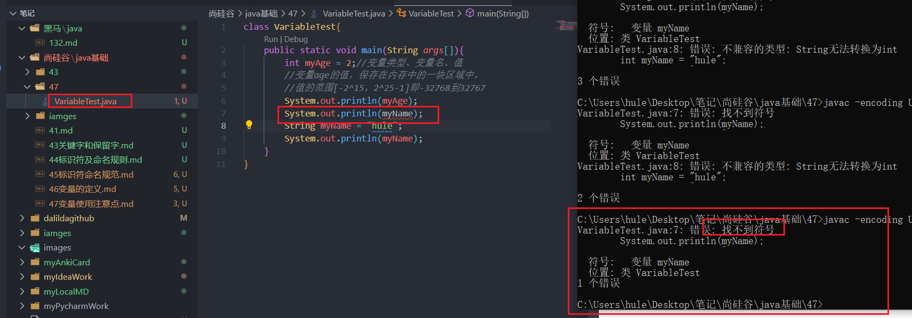

# 先声明后使用
```java
class VariableTest{
    public static void main(String args[]){
        int myAge = 2;//变量类型、变量名、值
        //变量age的值，保存在内存中的一块区域中。
        //值的范围[-2^15，2^25-1]即-32768到32767
        System.out.println(myAge);
        System.out.println(myName);
        String myName = "hule";
        System.out.println(myName);
    }
}

```
  

```note
javac编码GBK的不可映射字符时
可以用javac -encoding UTF-8 xxx.java
```

# 变量只在其作用域内生效
# 同一个作用域内不能定义重名变量
假设定义了，使用变量时，到底用哪个内存区域呢？