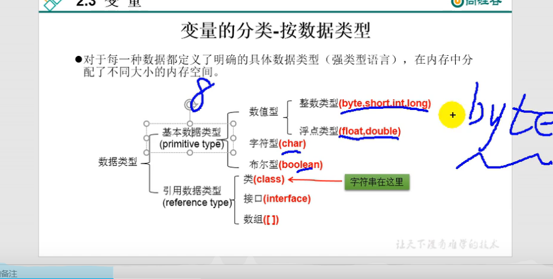

# 变量分类
## 基本数据类型

1. 数值型
   - 整数型 byte short int long
   - 浮点型 float double
2. 字符型char
3. 布尔型boolean

## 引用数据类型
1. 类
2. 接口
3. 数组
  
  

## 注意：String字符串是个类

```note
泛型不能用基本数据类型。因为jvm中全部打回成Object类型。
而基本数据类型不是Object类的子类。