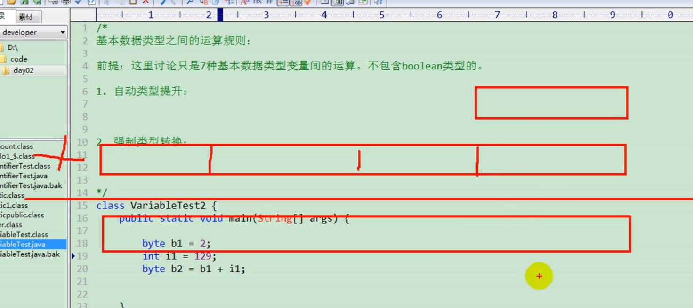

# 基本数据类型运算规则
1. 自动类型提升
2. 强制类型转换（逆过程）

# 自动类型提升
byte、short int long float double -->从小到大
char、byte、short运算结果是int类型的。（int范围内的做运算，一律用int存，很容易超了）

容量小的和容量大的做运算时，返回结果为容量大的。所以要用容量大类型的变量来接收。
此处容量大小，指的是数的表示范围大小。而不是占的字节大小。
像float占4字节，long占8字节，但是float表示数范围比long大。
```java
class Test{
    public static void main(String args[]){
        byte b1 = 2;
        int i1 = 129;
        // byte b2 = b1+i1;//报错
        int i2 = b1+i1;
        System.out.println(i2);
        short s1 = 32;
        // short s2 = s1+b1;
        // System.out.println(s2);
        // short s3 = 32;
        // short s4 = s1*s3;
    }
}
```

  
byte+int应该用int存
