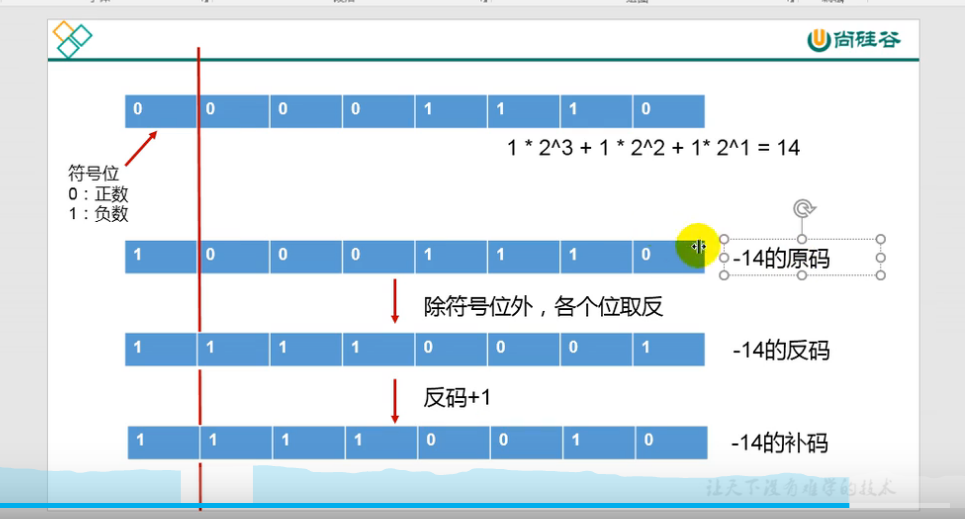

# 原码反码补码
  
计算机底层都以补码方式来存储

---

127原反补码:0111 1111
-127原码: 1111 1111
-127反码: 1000 0000
-127补码: 1000 0001
所以-128补码: 1000 0000

127: 0111 1111 加1后
     1000 0000
     变成了-128

---

十进制转二进制:除2取余倒排

---
二进制转八进制: 三位一起
二进制转十六进制: 四位一起