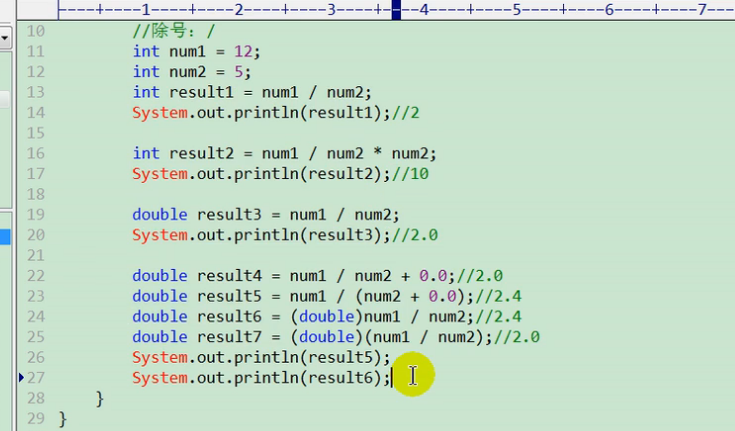
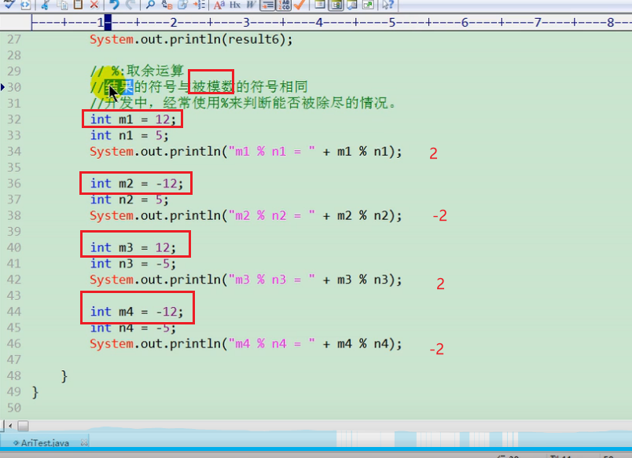

# 运算符
算数运算符
赋值运算符
比较运算符(关系运算符)
逻辑运算符
位运算符(比较少用)
三元运算符

> 首先是正负号加减乘除取模这些算数运算符.
> 算数运算符算出一个数可以存到变量中,所以有赋值运算符
> 除了赋值还能行另一个值比较大小,所以有比较运算符
> 比较完是boolean值,会有多个布尔值的关系,所以有逻辑运算符

# 算数运算符
+正号
-负号
+加号
-减号
*乘
/除
%取模
++(前)
++(后)
--(前)
--(后)
+字符串连接

---
除运算:
  
int a = 12/5;
为什么最后是2? 因为int和int运算最后是int类型,是整数
> 在python里12/5结果是2.4  12//5才是2

## 取模结果符号和被模数相同
12%5 = 2
12%(-5) =2
-12%5 =-2
-12%(-5) =-2
  
