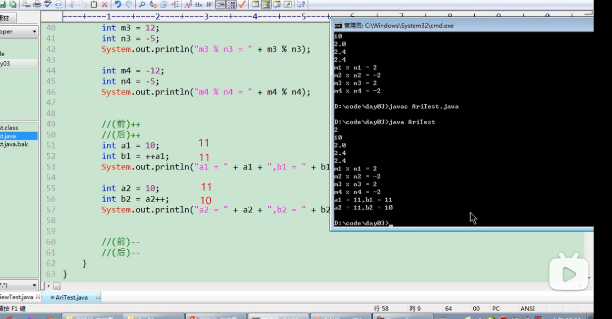

# ++运算符:
  

```java
class Test{
    public static void main(String args[]){
        a =10;
        b = a++;
        System.out.println(a);// a=11
        System.out.println(b);// b = 10
        a =10;
        b =++a;
        System.out.println(a);// a=11
        System.out.println(b);// b = 11
    }
}
```


## ++不改变变量数据类型
```java
class Test{
    public static void main(String args[]){
        short s = 10;
        // s = s+10;//报错
        s = (short)(s+10);//正确

        //上面+运算符改变了数据类型,自动类型提升

        s++;//++运算符不会改变数据类型
        //++运算符比+运算符快 不会先弄成长的,再截断成短的
        
        byte b1 =127;
        b1++;
        System.out.println(b1);//-128
        //进一步证明了++不改变数据类型,如果改变了就变成int了,结果就是128而不是-128
    }
}
```

# --运算符:
```java
class Test{
    public static void main(String args[]){
        int a4 = 10;
        int b4 = --a;
        int a4 = 10;
        int b4 = a4--;
    } 
}
```
