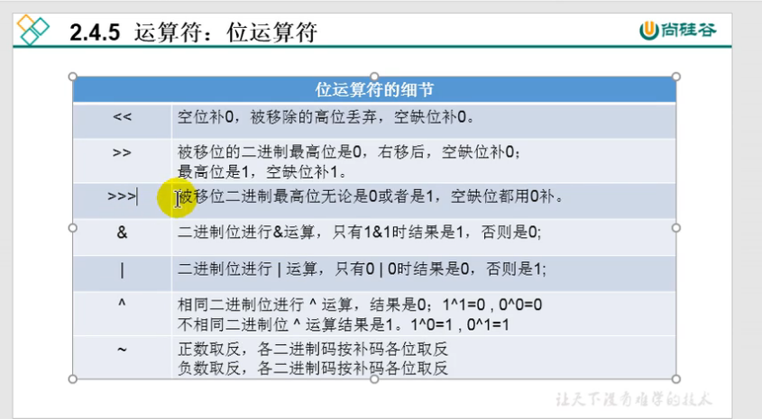

[TOC]
# 位运算符
<< >> >>> & | ^ ~ 

## << 左移
1101=(2^3+2^2+2^0) 左移两位后
110100 =2*2*(2^3+2^2+2^0)
所以每左移一位相当于乘2

# 说明
1. 位运算符操作的都是整型
2. << :在一定范围内,每向左移一位,相当于乘2
3. >> :在一定范围内,每向右移一位,相当于除2

# 面试题:
最高效的计算2*8?  2 << 3 或 8 << 1
```java
class Test{
    public static void main(String args[]){
        int i = 21;
        System.out.println(i<< 2);
        System.out.println(i<< 3);
    }
}
```

  
>>> 负数右移以后会变成正数。其实不是用来做乘除法操作的,在后面的集合求哈希值会用到
