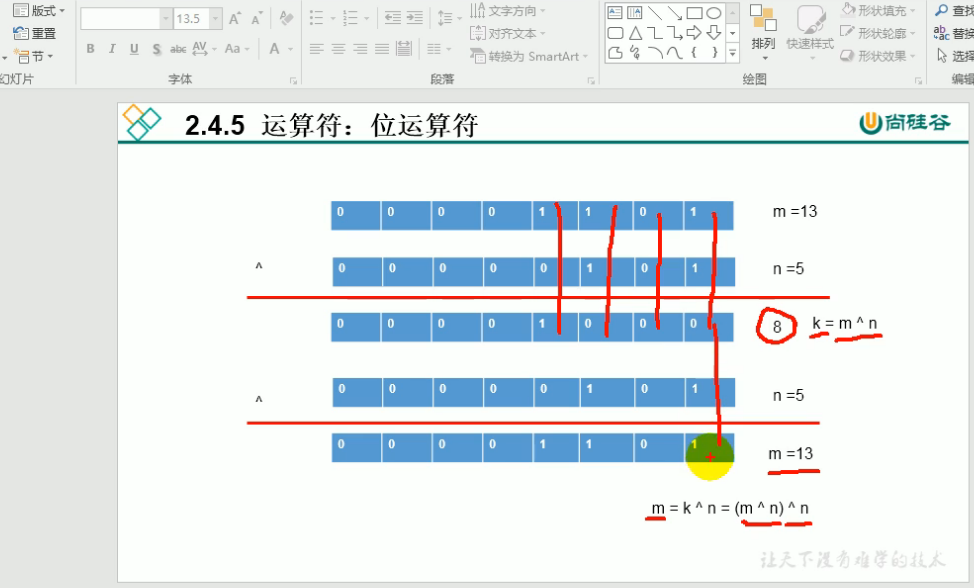

```java
class Test{
    public static void main(String args[]){
        int m = 12;
        int n = 5;
        //交换m,n的值
        //法1:利用中间变量
        // int tmp = m;
        // m = n;
        // n = tmp;

        //法2:m,n在悬崖两遍 n跳到m的脖子上,然后m跳到n之前在的地方
        //别用这种方法,虽然可以不用定义临时变量,但是有弊端
        //1.理解困难
        //2.相加可能超过范围
        //3.只能用于数值型
        m = m+n;//n跳到m上
        n = m-n;//m跳过去
        m = m-n;//减去跳过去的,就是留下的
        System.out.println("m:"+m+" n:"+n);

        //法3:使用位运算符
        //不会超过范围,
        //局限性:理解困难,只能用于数值型
        m = m ^ n ;
        n = m ^ n ;//m^n^n后面的n消掉了
        m = m ^ n ;//m^n^m中m消掉了
        System.out.println("m:"+m+" n:"+n);

    }
}
```

  
