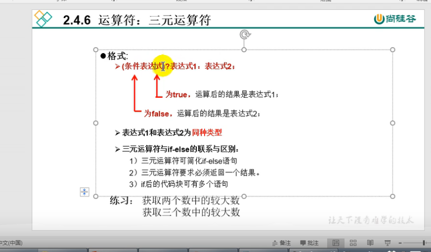

# 三元运算符
  
1.结构: (条件表达式)? 表达式1:表示式2
2.说明: 
> 条件表达式的结果是布尔值
> 根据条件表达式的真或假, 决定执行表达式1还是表达式2
> 表达式1 和表达式2 要一致 返回的值要统一
> 三元运算符可以嵌套
3. 凡是可以使用三元运算符的,也可以使用ifelse
   反之,不成立 三元运算符要求表达式一致
4. 如果程序可以使用三元运算符,也可以使用ifelse,有限选择三元运算符
   原因:三元运算符是毕竟运算符,效率高  ifelse是流程控制语句,效率要低一些

```java
class Test{
    public static void main(String args[]){
        //获取两个整的较大值
        int m = 12;
        int n = 5;
        System.out.println((m>n)? m :n);

        // int d = (m>n)?2:1.0;//精度损失
        double d = (m>n)?2:1.0;
        //(m>n)?2:"a大";//编译错误!   这种表达式返回的值不能统一,不知道拿什么存
        
        //***********
        n=12;
        String maxStr = (m>n)?"m大":((m==n)?"一样大":"n大");
        System.out.println(maxStr);

        //***********
        int n1 = 120;
        int n2 = 30;
        int n3 = 43;
        // int maxValue = (n1>n2)?((n1>n3)?n1:n3):((n2>n3)?n2:n3);
        //虽然只有一行,但是可读性差,修改起来麻烦,交接麻烦

        int max1 = (n1>n2)?n1:n2;
        int maxValue = (max1>n3)?max1:n3;
        System.out.println(maxValue);
    }
}
```