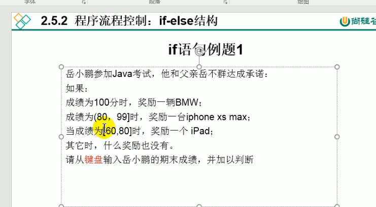

  

1. 导包:导入Scanner包
2. Scanner的实例化 Scanner sc = new Scanner(System.in);
3. 调用Scanner的相关方法, 获取指定类型的变量

注意:
需要根据相应的方法,来输入指定类型的值 类型不一致会报异常:InputMisMatchException
导致程序终止.
```java
import java.util.Scanner ;
class Test{
        public static void main(String[] args) {
            Scanner sc = new Scanner(System.in);
            System.out.println("input your name!");
            String name = sc.next();
            System.out.println(name);
            
            System.out.println("input your age");
            int age = sc.nextInt();
            System.out.println(age);

            System.out.println("input your weight");
            double weight = sc.nextDouble();
            System.out.println(weight);

            System.out.println("is your married<true/false>");
            boolean isMarried = sc.nextBoolean();
            System.out.println(isMarried);

            //对于char 型的获取,Scanner 没有提供相关的方法,只能获取一个字符串
            System.out.println("input your gender");
            String gender = sc.next();//"男"
            char genderChar = gender.charAt(0);
            System.out.println(genderChar);
        }
}
```